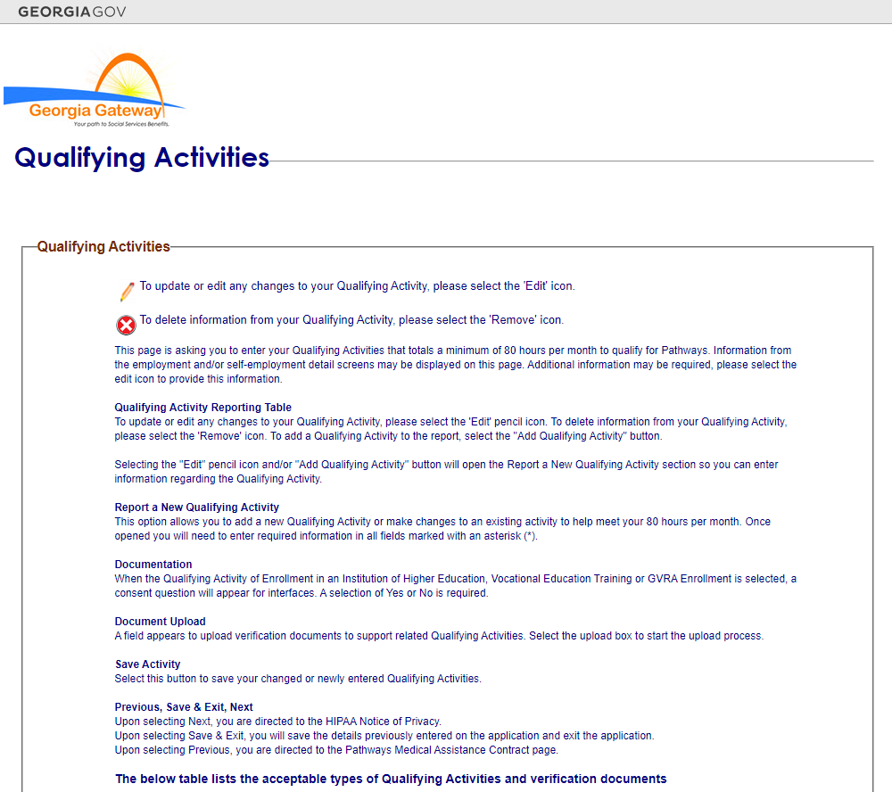
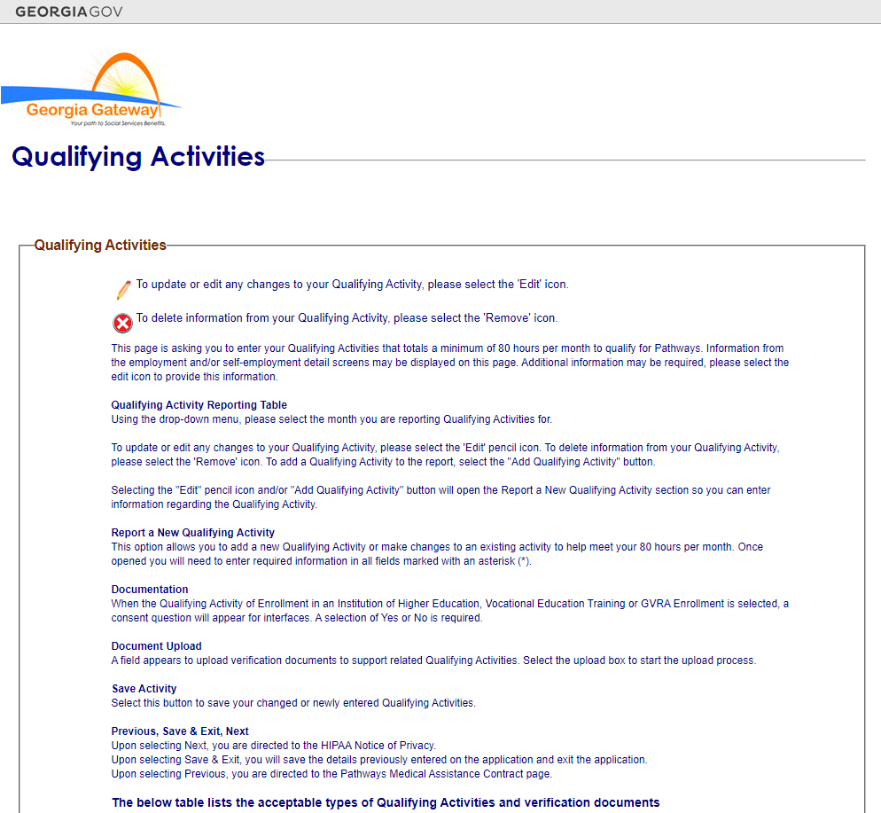
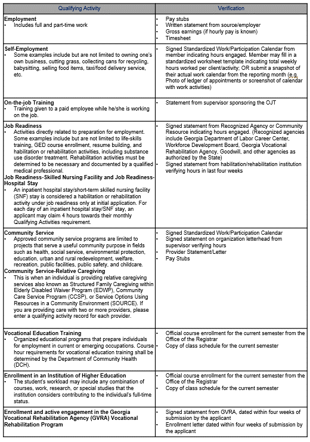

# Screenshot

[cols="60%,1,1,1,1,1,1,1,1,1,1,1,1,1,1,1,1,1,1,1,1,1,1,1,1,1,1,1,1,1,1", options="header"]
|===
| GA IES - Data Collection - Help Text - Qualifying Activities Definitions and Acceptable Verification | Unnamed: 1 | Unnamed: 2 | Unnamed: 3 | Unnamed: 4 | Unnamed: 5 | Unnamed: 6 | Unnamed: 7 | Unnamed: 8 | Unnamed: 9 | Unnamed: 10 | Unnamed: 11 | Unnamed: 12 | Unnamed: 13 | Unnamed: 14 | Unnamed: 15 | Unnamed: 16 | Unnamed: 17 | Unnamed: 18 | Unnamed: 19 | Unnamed: 20 | Unnamed: 21 | Unnamed: 22 | Unnamed: 23 | Unnamed: 24 | Unnamed: 25 | Unnamed: 26 | Unnamed: 27 | Unnamed: 28 | Unnamed: 29 | Unnamed: 30
| nan | nan | nan | nan | nan | nan | nan | nan | nan | nan | nan | nan | nan | nan | nan | nan | nan | nan | nan | nan | nan | nan | nan | nan | nan | nan | nan | nan | nan | nan | nan
| The Qualifying Activities Help Text screen allows an individual to see the different Qualifying Activity types, their appropriate definitions, and the acceptable verification documentation for each Qualifying Activity | nan | nan | nan | nan | nan | nan | nan | nan | nan | nan | nan | nan | nan | nan | nan | nan | nan | nan | nan | nan | nan | nan | nan | nan | nan | nan | nan | nan | nan | nan
| nan | nan | nan | nan | nan | nan | nan | nan | nan | nan | nan | nan | nan | nan | nan | nan | nan | nan | nan | nan | nan | nan | nan | nan | nan | nan | nan | nan | nan | nan | nan
| nan | nan | nan | nan | nan | nan | nan | nan | nan | nan | nan | nan | nan | nan | nan | nan | nan | nan | nan | nan | nan | nan | nan | nan | nan | nan | nan | nan | nan | nan | nan
| nan | nan | nan | nan | AFB/RMB Mode | nan | nan | nan | nan | nan | nan | nan | nan | nan | nan | nan | nan | RMC Mode | nan | nan | nan | nan | nan | nan | nan | nan | nan | nan | nan | nan | All Modes
|===

# Storyboard

[cols="3,1,1,1,1,1,1,1,1,1,1,1,1,1,1,1,1,1,1,1,1,1,1,1", options="header"]
|===
| Target Field | Target Type | Format | Mandatory | Hover/Help Text | Display Rule | Default Value | Reference Table Name | Event/Business Logic | Validation Condition | Validation ID | Open Questions | Status | MAGI | Medicaid | PeachCare | Food Stamps | TANF | LIHEAP | Child Care | WIC | Table Name | Column Name | JSP Name
| Pathways Qualifying Activities | Screen | nan | nan | nan | In the Qualifying Activity Hours screen, there is an Information Icon that is displayed in the description. If the Information Icon is clicked, this window will appear. | nan | nan | nan | nan | nan | nan | Add | Yes | nan | nan | nan | nan | nan | nan | nan | CP_DPLY_TXT | TXT_ID | ABQualifyingHelpText.jsp
| *Image of Pencil Icon* To update or edit any changes to your Qualifying Activity, please select the ‘Edit’ icon | Label | nan | nan | nan | nan | nan | nan | nan | nan | nan | nan | Add | Yes | nan | nan | nan | nan | nan | nan | nan | CP_DPLY_TXT | TXT_ID | ABQualifyingHelpText.jsp
| *Image of Remove Icon* To delete information from your Qualifying Activity, please select the ‘Remove’ icon. | Label | nan | nan | nan | nan | nan | nan | nan | nan | nan | nan | Add | Yes | nan | nan | nan | nan | nan | nan | nan | CP_DPLY_TXT | TXT_ID | ABQualifyingHelpText.jsp
| This page is asking you to enter your Qualifying Activities that totals a minimum of 80 hours per month to qualify for Pathways. Information from the employment and/or self-employment detail screens may be displayed on this page. Additional information may be required, please select the edit icon to provide this information. | Text | nan | nan | nan | nan | nan | nan | nan | nan | nan | nan | Add | Yes | nan | nan | nan | nan | nan | nan | nan | CP_DPLY_TXT | TXT_ID | ABQualifyingHelpText.jsp
| Qualifying Activity Reporting Table | Section Header | nan | nan | nan | nan | nan | nan | nan | nan | nan | nan | Add | Yes | nan | nan | nan | nan | nan | nan | nan | CP_DPLY_TXT | TXT_ID | ABQualifyingHelpText.jsp
| Using the drop-down menu, please select the month you are reporting Qualifying Activities for. ​ | Text | nan | nan | nan | Only display this in RMC mode. | nan | nan | nan | nan | nan | nan | Add | Yes | nan | nan | nan | nan | nan | nan | nan | CP_DPLY_TXT | TXT_ID | ABQualifyingHelpText.jsp
| To update or edit any changes to your Qualifying Activity, please select the ‘Edit’ pencil icon. To delete information from your Qualifying Activity, please select the ‘Remove’ icon.  To add a Qualifying Activity to the report, select the “Add Qualifying Activity” button. 

Selecting the “Edit” pencil icon and/or “Add Qualifying Activity” button will open the Report a New Qualifying Activity section so you can enter information regarding the Qualifying Activity. ​ | Text | nan | nan | nan | nan | nan | nan | nan | nan | nan | nan | Add | Yes | nan | nan | nan | nan | nan | nan | nan | CP_DPLY_TXT | TXT_ID | ABQualifyingHelpText.jsp
| Report a New Qualifying Activity​ | Section Header | nan | nan | nan | nan | nan | nan | nan | nan | nan | nan | Add | Yes | nan | nan | nan | nan | nan | nan | nan | CP_DPLY_TXT | TXT_ID | ABQualifyingHelpText.jsp
| This option allows you to add a new Qualifying Activity or make changes to an existing activity to help meet your 80 hours per month.  Once opened you will need to enter required information in all fields marked with an asterisk (*).​ | Text | nan | nan | nan | nan | nan | nan | nan | nan | nan | nan | Add | Yes | nan | nan | nan | nan | nan | nan | nan | CP_DPLY_TXT | TXT_ID | ABQualifyingHelpText.jsp
| Documentation​ | Section Header | nan | nan | nan | nan | nan | nan | nan | nan | nan | nan | Add | Yes | nan | nan | nan | nan | nan | nan | nan | CP_DPLY_TXT | TXT_ID | ABQualifyingHelpText.jsp
| When the Qualifying Activity of Enrollment in an Institution of Higher Education, Vocational Education Training or GVRA Enrollment is selected, a consent question will appear for interfaces. A selection of “Yes” or “No” is required.​ | Text | nan | nan | nan | nan | nan | nan | nan | nan | nan | nan | Add | Yes | nan | nan | nan | nan | nan | nan | nan | CP_DPLY_TXT | TXT_ID | ABQualifyingHelpText.jsp
| Document Upload​ | Section Header | nan | nan | nan | nan | nan | nan | nan | nan | nan | nan | Add | Yes | nan | nan | nan | nan | nan | nan | nan | CP_DPLY_TXT | TXT_ID | ABQualifyingHelpText.jsp
| A field appears to upload verification documents to support related Qualifying Activities. Select the upload box to start the upload process.​ | Text | nan | nan | nan | nan | nan | nan | nan | nan | nan | nan | Add | Yes | nan | nan | nan | nan | nan | nan | nan | CP_DPLY_TXT | TXT_ID | ABQualifyingHelpText.jsp
| Save Activity​ | Section Header | nan | nan | nan | nan | nan | nan | nan | nan | nan | nan | Add | Yes | nan | nan | nan | nan | nan | nan | nan | CP_DPLY_TXT | TXT_ID | ABQualifyingHelpText.jsp
| Select this button to save your changed or newly entered Qualifying Activities.​ | Text | nan | nan | nan | nan | nan | nan | nan | nan | nan | nan | Add | Yes | nan | nan | nan | nan | nan | nan | nan | CP_DPLY_TXT | TXT_ID | ABQualifyingHelpText.jsp
| Previous, Save & Exit, Next​ | Section Header | nan | nan | nan | nan | nan | nan | nan | nan | nan | nan | Add | Yes | nan | nan | nan | nan | nan | nan | nan | CP_DPLY_TXT | TXT_ID | ABQualifyingHelpText.jsp
| Upon selecting Next, you are directed to the HIPAA Notice of Privacy. ​
Upon selecting Save & Exit, you will save the details previously entered on the application and exit the application.​
Upon selecting Previous, you are directed to the Pathways Medical Assistance Contract page. ​ | Text | nan | nan | nan | nan | nan | nan | nan | nan | nan | nan | Add | Yes | nan | nan | nan | nan | nan | nan | nan | CP_DPLY_TXT | TXT_ID | ABQualifyingHelpText.jsp
| The below table lists the acceptable types of Qualifying Activities and verification documents | Section Header | nan | nan | nan | nan | nan | nan | nan | nan | nan | nan | Add | Yes | nan | nan | nan | nan | nan | nan | nan | CP_DPLY_TXT | TXT_ID | ABQualifyingHelpText.jsp
| Qualifying Activity | Label | nan | nan | nan | nan | nan | nan | nan | nan | nan | nan | Add | Yes | nan | nan | nan | nan | nan | nan | nan | CP_DPLY_TXT | TXT_ID | ABQualifyingHelpText.jsp
| Definition | Label | nan | nan | nan | nan | nan | nan | nan | nan | nan | nan | Add | Yes | nan | nan | nan | nan | nan | nan | nan | CP_DPLY_TXT | TXT_ID | ABQualifyingHelpText.jsp
| Verification | Label | nan | nan | nan | nan | nan | nan | nan | nan | nan | nan | Add | Yes | nan | nan | nan | nan | nan | nan | nan | CP_DPLY_TXT | TXT_ID | ABQualifyingHelpText.jsp
| Employment
•	Includes full and part-time work | Label | nan | nan | nan | nan | nan | nan | nan | nan | nan | nan | Add | Yes | nan | nan | nan | nan | nan | nan | nan | CP_DPLY_TXT | TXT_ID | ABQualifyingHelpText.jsp
| • Pay stubs
• Written statement from source/employer
• Gross earnings (if hourly pay is known)
• Timesheet | Label | nan | nan | nan | nan | nan | nan | nan | nan | nan | nan | Add | Yes | nan | nan | nan | nan | nan | nan | nan | CP_DPLY_TXT | TXT_ID | ABQualifyingHelpText.jsp
| Self-Employment
•	Some examples include but are not limited to owning one’s own business, cutting grass, collecting cans for recycling, babysitting, selling food items, taxi/food delivery service, etc. | Label | nan | nan | nan | nan | nan | nan | nan | nan | nan | nan | Add | Yes | nan | nan | nan | nan | nan | nan | nan | CP_DPLY_TXT | TXT_ID | ABQualifyingHelpText.jsp
| •  Signed Standardized Work/Participation Calendar from member indicating hours engaged. Member may fill in a standardized worksheet template indicating total weekly hours worked per client/activity; OR submit a snapshot of their actual work calendar from the reporting month (e.g. Photo of ledger of appointments or screenshot of calendar with work activities) | Label | nan | nan | nan | nan | nan | nan | nan | nan | nan | nan | Add | Yes | nan | nan | nan | nan | nan | nan | nan | CP_DPLY_TXT | TXT_ID | ABQualifyingHelpText.jsp
| On-the-job Training
•	Training given to a paid employee while he/she is working on the job. | Label | nan | nan | nan | nan | nan | nan | nan | nan | nan | nan | Add | Yes | nan | nan | nan | nan | nan | nan | nan | CP_DPLY_TXT | TXT_ID | ABQualifyingHelpText.jsp
| • Statement from supervisor sponsoring the OJT | Label | nan | nan | nan | nan | nan | nan | nan | nan | nan | nan | Add | Yes | nan | nan | nan | nan | nan | nan | nan | CP_DPLY_TXT | TXT_ID | ABQualifyingHelpText.jsp
| Job Readiness
•	Activities directly related to preparation for employment.  Some examples include but are not limited to life-skills training, GED course enrollment, resume building, and habilitation or rehabilitation activities, including substance use disorder treatment. Rehabilitation activities must be determined to be necessary and documented by a qualified medical professional.
Job Readiness-Skilled Nursing Facility and Job Readiness-Hospital Stay
•	An inpatient hospital stay/short-term skilled nursing facility (SNF) stay is considered a habilitation or rehabilitation activity under job readiness only at initial application. For each day of an inpatient hospital stay/SNF stay, an applicant may claim 4 hours towards their monthly Qualifying Activities requirement. | Label | nan | nan | nan | nan | nan | nan | nan | nan | nan | nan | Add | Yes | nan | nan | nan | nan | nan | nan | nan | CP_DPLY_TXT | TXT_ID | ABQualifyingHelpText.jsp
| • Signed statement from Recognized Agency or Community Resource indicating hours engaged. (Recognized agencies include Georgia Department of Labor Career Center, Workforce Development Board, Georgia Vocational Rehabilitation Agency, Goodwill, and other agencies as authorized by the State)
• Signed statement from habilitation/rehabilitation institution verifying hours in last four weeks
 | Label | nan | nan | nan | nan | nan | nan | nan | nan | nan | nan | Add | Yes | nan | nan | nan | nan | nan | nan | nan | CP_DPLY_TXT | TXT_ID | ABQualifyingHelpText.jsp
| Community Service
•	Approved community service programs are limited to projects that serve a useful community purpose in fields such as health, social service, environmental protection, education, urban and rural redevelopment, welfare, recreation, public facilities, public safety, and childcare.
Community Service-Relative Caregiving
•	This is when an individual is providing relative caregiving services also known as Structured Family Caregiving within Elderly Disabled Waiver Program (EDWP), Community Care Service Program (CCSP), or Service Options Using Resources in a Community Environment (SOURCE). If you are providing care with two or more providers, please enter a qualifying activity record for each provider. | Label | nan | nan | nan | nan | nan | nan | nan | nan | nan | nan | Add | Yes | nan | nan | nan | nan | nan | nan | nan | CP_DPLY_TXT | TXT_ID | ABQualifyingHelpText.jsp
| • Signed Standardized Work/Participation Calendar 
• Signed statement on organization letterhead from supervisor verifying hours
• Provider Statement/Letter
• Pay Stubs | Label | nan | nan | nan | nan | nan | nan | nan | nan | nan | nan | Add | Yes | nan | nan | nan | nan | nan | nan | nan | CP_DPLY_TXT | TXT_ID | ABQualifyingHelpText.jsp
| Vocational Education Training
•	Organized educational programs that prepare individuals for employment in current or emerging occupations. Course hour requirements for vocational education training shall be determined by the Department of Community Health (DCH). | Label | nan | nan | nan | nan | nan | nan | nan | nan | nan | nan | Add | Yes | nan | nan | nan | nan | nan | nan | nan | CP_DPLY_TXT | TXT_ID | ABQualifyingHelpText.jsp
| • Official course enrollment for the current semester from the Office of the Registrar
• Copy of class schedule for the current semester | Label | nan | nan | nan | nan | nan | nan | nan | nan | nan | nan | Add | Yes | nan | nan | nan | nan | nan | nan | nan | CP_DPLY_TXT | TXT_ID | ABQualifyingHelpText.jsp
| Enrollment in an Institution of Higher Education
•	The student's workload may include any combination of courses, work, research, or special studies that the institution considers contributing to the individual’s full-time status. | Label | nan | nan | nan | nan | nan | nan | nan | nan | nan | nan | Add | Yes | nan | nan | nan | nan | nan | nan | nan | CP_DPLY_TXT | TXT_ID | ABQualifyingHelpText.jsp
| • Official course enrollment for the current semester from the Office of the Registrar
• Copy of class schedule for the current semester
 | Label | nan | nan | nan | nan | nan | nan | nan | nan | nan | nan | Add | Yes | nan | nan | nan | nan | nan | nan | nan | CP_DPLY_TXT | TXT_ID | ABQualifyingHelpText.jsp
| Enrollment and active engagement in the Georgia Vocational Rehabilitation Agency (GVRA) Vocational Rehabilitation Program | Label | nan | nan | nan | nan | nan | nan | nan | nan | nan | nan | Add | Yes | nan | nan | nan | nan | nan | nan | nan | CP_DPLY_TXT | TXT_ID | ABQualifyingHelpText.jsp
| • Signed statement from GVRA, dated within four weeks of submission by the applicant
• Enrollment letter dated within 4 weeks of submission by the applicant | Label | nan | nan | nan | nan | nan | nan | nan | nan | nan | nan | Add | Yes | nan | nan | nan | nan | nan | nan | nan | CP_DPLY_TXT | TXT_ID | ABQualifyingHelpText.jsp
| Close Window | Button | Button | nan | nan | nan | nan | nan | On click this Help Screen window will close and the individual will be able to report their qualifying activity hours | nan | nan | nan | Add | Yes | nan | nan | nan | nan | nan | nan | nan | CP_DPLY_TXT | TXT_ID | ABQualifyingHelpText.jsp
|===

# Validation Error Messages

[cols="3,1,1", options="header"]
|===
| Validation ID | Validation Description | Type
| nan | nan | Error
|===

# CodeTable

[cols="3,1,1", options="header"]
|===
| Reference Table Name | Code | Description
| EDUVERIFICATION | CV | Conversion
| EDUVERIFICATION | CS | Client Statement
| EDUVERIFICATION | CC | Collateral Contact
| EDUVERIFICATION | BS | BS Degree Seen
| EDUVERIFICATION | BA | BA Degree Seen
| EDUVERIFICATION | AA | AA Degree Seen
| ENROLLSTATUS | UK | Unknown
| ENROLLSTATUS | NR | Not Enrolled
| ENROLLSTATUS | HT | Half-time
| ENROLLSTATUS | FT | Full-time
| YESNO | Y | YES
| YESNO | N | NO
| EDUINSTITYPE | VO | Vocational
| EDUINSTITYPE | TR | Trade School
| EDUINSTITYPE | TC | Technical
| EDUINSTITYPE | PS | Business School
| EDUINSTITYPE | OT | Other
| EDUINSTITYPE | MS | Middle School
| EDUINSTITYPE | HS | High School
| EDUINSTITYPE | HM | Home Schooling
| EDUINSTITYPE | GD | GED Program
| EDUINSTITYPE | EL | Elementary
| EDUINSTITYPE | CL | College or University
| EDUINSTITYPE | CC | Community College or Junior College
| STUDENTFITVRF | VO | Visual observation
| STUDENTFITVRF | OT | Other
| STUDENTFITVRF | NV | Not Verified/Questionable
| STUDENTFITVRF | DB | Receipt/proof of disability benefits
| STUDENTFITVRF | CV | Conversion
| STUDENTFITVRF | CS | Certified doctor/psychologist statement
| HSGRADSTATUS | UK | Unknown
| HSGRADSTATUS | NG | Not Graduated
| HSGRADSTATUS | GR | Graduated/GED
| HIGHESTLEVELEDU | AA | 2 yr Degree
| HIGHESTLEVELEDU | BA | 4 yr Degree
| HIGHESTLEVELEDU | G1 | 1st Grade
| HIGHESTLEVELEDU | G2 | 2nd Grade
| HIGHESTLEVELEDU | G3 | 3rd Grade
| HIGHESTLEVELEDU | G4 | 4th Grade
| HIGHESTLEVELEDU | G5 | 5th Grade
| HIGHESTLEVELEDU | G6 | 6th Grade
| HIGHESTLEVELEDU | G7 | 7th Grade
| HIGHESTLEVELEDU | G8 | 8th Grade
| HIGHESTLEVELEDU | G9 | 9th Grade
| HIGHESTLEVELEDU | HI | Post 4 yr Degree
| HIGHESTLEVELEDU | HS | Head Start
| HIGHESTLEVELEDU | JU | 11th Grade
| HIGHESTLEVELEDU | K1 | Kindergarten
| HIGHESTLEVELEDU | NO | No Formal Education
| HIGHESTLEVELEDU | PK | Pre-Kindergarten
| HIGHESTLEVELEDU | SC | Some College, Not Graduated
| HIGHESTLEVELEDU | SE | 12th Grade or GED Completed
| HIGHESTLEVELEDU | SO | 10th Grade
| HIGHESTLEVELEDU | UK | Unknown
| EDUVERIFICATION | TR | Transcript
| EDUVERIFICATION | SS | School Statement
| EDUVERIFICATION | OT | Other Acceptable
| EDUVERIFICATION | NV | Not Verified/Questionable
| EDUVERIFICATION | MR | Military Record
| EDUVERIFICATION | HS | High School Diploma
| EDUVERIFICATION | DD | Doctorate Degree Seen
|===

# ChimesCodeTable

[cols="3,1,1", options="header"]
|===
| Reference Table Name | Code | Description
| CHM_STUDENT_STATUS_CODES | 7GT12 | Attending Grades 7-12 > 12 hrs/wk
| CHM_STUDENT_STATUS_CODES | 7LT12 | Attending Grades 7-12 <= 12 hrs/wk
| CHM_STUDENT_STATUS_CODES | CGT8 | Attending College > 8 hrs/wk
| CHM_STUDENT_STATUS_CODES | CLT8 | Attending College <= 8 hrs/wk
| CHM_STUDENT_STATUS_CODES | K6 | Attending Grades K-6
| CHM_STUDENT_STATUS_CODES | NAS | Not Attending School
| CHM_STUDENT_STATUS_CODES | TGT12 | Attending Training Course > 12 hrs/wk
| CHM_STUDENT_STATUS_CODES | TLT12 | Attending Training Course <= 12 hrs/wk
|===

# HelpText

[cols="3,1,1", options="header"]
|===
| Target Column | Page/Field Description | Help text
| nan | Education - Details | The Education - Details page is used to enter the educational record of individuals between 6 and 59 years of age. This page contains five sections: Individual Information, Dates, Age Information, High School Graduation Information and Educational Details.~~{Note}: Education level is required for several assistance programs and is needed to determine LIF eligibility for 18 and 19 year old dependents. Education level and status is required at this point, as it is unknown what MA might be approved, and what group members may be mandatory and require this information to correctly determine whether this individual is included or excluded from the Medicaid group. For non-requesting individuals, unknown" may be selected. This should not  however  hold up MA benefits.~~{Individual Information}: This section displays the name and individual number of a person whose educational record is being entered  updated or viewed.~~{Dates}: This section is used to enter the Circumstances Start/Change Date  Reported On  Date Client Became Aware and Verification Received On dates These are all required fields.~~{Age Information}: This section displays the date of birth and age of the individuals.~~{High School Graduation Information}: This section is used to enter information about the individual's high school status. The Status field is required.~~{Education Details}: This section is used to enter information about the individual's overall educational status. Highest level of Education Completed  Enrollment Status and Verification fields are required."
| PI Name | Case Name | nan
| Case # | Case # | nan
| Case Action | Case Action | Enter Help Text Here
| Name | Name | nan
| Individual # | Individual # | nan
| End Date | End Date | This field is disabled. the End Date will display on historical records.
| Status | Status | Select the status of the individual's high school completion from the drop-down list.
| H.S. Diploma required? | H.S. Diploma required | Indicate whether a High School diploma is required for the individual.
| Type of Educational Institution | Type of Educational Institution | Select the type of educational institution from the drop-down list.
| Enrolled in training program? | Enrolled in training program | Select the appropriate response if individual is enrolled in a training program from the drop-down list.
| Enrolled in a program or work study? | Enrolled In program or work study | Select the appropriate response if individual is enrolled in a program or work study from the drop-down list.
| Individual education plan approved? | Individual education plan approved | Indicate whether the individual has had an educational plan that has been approved by the appropriate person.
| Will the curriculum lead to a high school diploma or GED? | Will the curriculum lead to a high school diploma or GED | Select the appropriate response from the drop-down list.
| Able To Work? | Able To Work | Select the appropriate response from the drop-down list.
| If No, Verification | If No, Verification | Select the appropriate response from the drop-down list. This is a required field.
|===

# Change Log

[cols="3,1,1,1,1,1", options="header"]
|===
| Version Number | Date | Description of Change Made | Review Comment (Ref comment # from response sheet) | Location of Change (e.g. Cell, row, etc.) | Requirements
| vPATHWAYSv0.1 | 2020-10-30 00:00:00 | New Screen | Pathways Waiver Implementation | New Screen | FR-0312
| vPATHWAYSv0.2 | 2020-11-13 00:00:00 | The display logic was updated to clarify that the help text screen is displayed when the user clicks the information icon on the Qualifying Activities screen.  | Display logic updated to address comment # 133 | F2 | FR-CP-0312
| vPATHWAYSv1.0 | 2020-12-16 00:00:00 | Technical details updated and Final design submission

Text updated in all cells of Help Screen table | nan | Rows:2 to 31, Columns: v,w,x

6A - 23A | nan
| vPATHWAYSv2.0 | 2021-01-08 00:00:00 | Updated to address Release 1 client comments | Comment ID 548, 546 & 547 | Rows 7A, 10A, 11A, 3C (change log) | nan
| vPATHWAYSv2.1 | 2021-01-14 00:00:00 | Updated to address Release 1 client comments | Comment ID 546 | 7A, 10A | nan
| vPATHWAYSv3.0 | 2021-02-24 00:00:00 | Updated per CR 712441 to remove bottom section box related to RM examples.  | CR 712441 | Storyboard row removed, Screenshot | nan
| vPATHWAYSv3.1 | 2021-03-09 00:00:00 | Fixed typo from "data" to "dated" | nan | Screenshot, storyboard cell 22A | nan
| vPATHWAYSv3.2 | 2021-05-05 00:00:00 | Modified "Help" for the Header to read "Pathways Qualifying Activities" per UAT Defect ID 111351
Updated rows 3 & 4 per to add additional help text for the Edit Pencil and Remove icon per Defect 111310.  | UAT Defect ID 111351
UAT Defect ID 111310
 | Screenshot, storyboard cell 2A, row 3& 4 | nan
| vPATHWAYS2.0v0.1 | 2023-02-09 00:00:00 | Pathways 2.0 Interim submission | nan | nan | nan
| vPATHWAYS2.0v1.0 | 2023-03-01 00:00:00 | Final Design Submission | nan | nan | nan
| vPATHWAYS2.0v1.1 | 2023-05-08 00:00:00 | Updated Verbiage in 'Job Readiness' Section to include logic for Hospital Stays per CMS request. | nan | Storyboard Cell: A15, Screenshot: 'Job Readiness' | nan
| vPATHWAYS2.0v1.2 | 2023-06-09 00:00:00 | Updated Screenshots to match Help Pages ppt deck | nan | Screenshot | nan
| vPathways2.0_R42v3.0 | 2023-10-24 00:00:00 | Updated Screenshot and Details with Job Readiness-Skilled Nursing Facility and Job Readiness-Hospital Stay title. | Release 42 Submission
CR# 828262 | Storyboard: A15
Screenshot | FR-CP-2309
| vPathways2.0_R42v3.1 | 2023-11-15 00:00:00 | Updated  Screenshot and Details for the Target Fied - Job Readiness-Skilled Nursing Facility and Job Readiness-Hospital Stay FROM An inpatient hospital stay is considered a habilitation or rehabilitation activity under job readiness only at initial application. For each day of an inpatient hospital stay, an applicant may claim 4 hours towards their monthly Qualifying Activities requirement. TO
An inpatient hospital stay/short-term skilled nursing facility (SNF) stay is considered a habilitation or rehabilitation activity under job readiness only at initial application. For each day of an inpatient hospital stay/SNF stay, an applicant may claim 4 hours towards their monthly Qualifying Activities requirement. | nan | Storyboard: A15
Screenshot | nan
| vPathways2.0_R42v3.2 | 2024-01-29 00:00:00 | Updated screenshots to display updated verbiage. Also included/updated missing text that displays on the QA description screen. | In response to Defect ID# 60096 | Screenshot
Storyboard: Added rows 5-18, A2 | nan
| vPathways2.0_R43v4.0 | 2024-02-01 00:00:00 | 1. Added Community Service-Relative Caregiving, description, and added acceptable verifications ‘Provider Statement/Letter’ and ‘Pay Stubs’.
2. Screenshot and storyboard verbiage updated from "Vocational Educational Training" to "Vocational Education Training". | Release 43 Submission
CR# 838560 | 1. Storyboard: A31, A32
Screenshot
2. Storyboard: A33
Screenshot | 1. FR-CP-2317
FR-CP-2319
2. FR-CP-2325
| vPathways2.0_R43v4.1 | 2024-02-08 00:00:00 | Updated Relative Caregiving verbiage from 'If you are providing care for two individuals with two separate providers, please enter a qualifying activity record for each provider.' to 'If you are providing care with two or more providers, please enter a qualifying activity record for each provider.'. | Release 43 Submission 2
CR# 838560 | 1. Storyboard: A31
Screenshot | nan
|===

